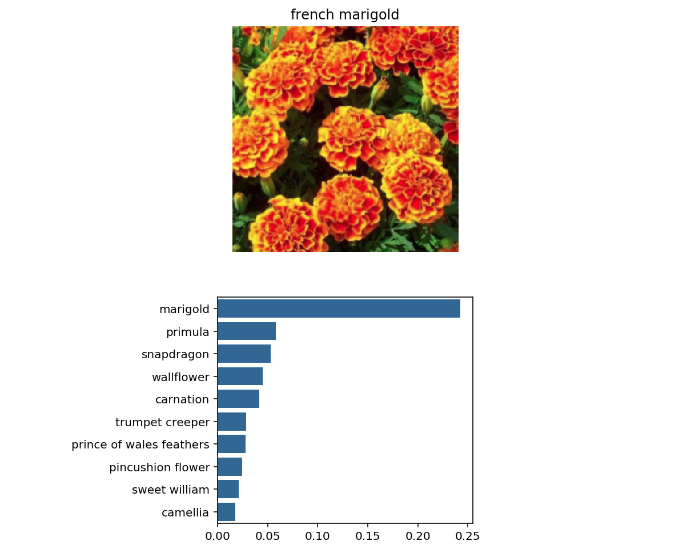

# Image classifier

AI Programming with Python Nanodegree final project. In this project, I built with PyTorch a generic image classifier which can perform classification after being trained on any set of labeled images, then converted it into a command line application.
 
### Features: 
- Save and continue the training from a checkpoint
- Choose the CNN architecture between alexnet, densenet, vgg, etc.
- Set custom hyperparameters (learning rate, dropout, epochs, number of nodes on the hidden layer)
- Use GPU for training and inference
- Return the top-K most likely classes
- Use a mapping of classes to real names.

